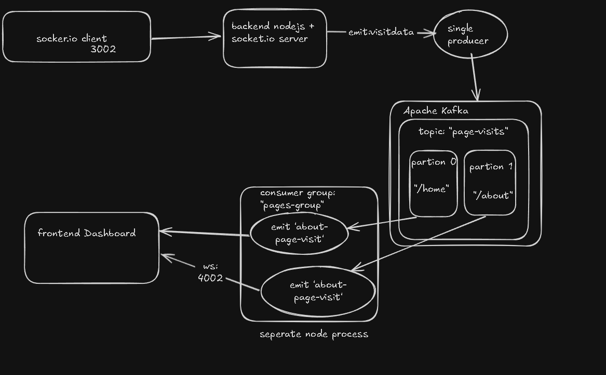
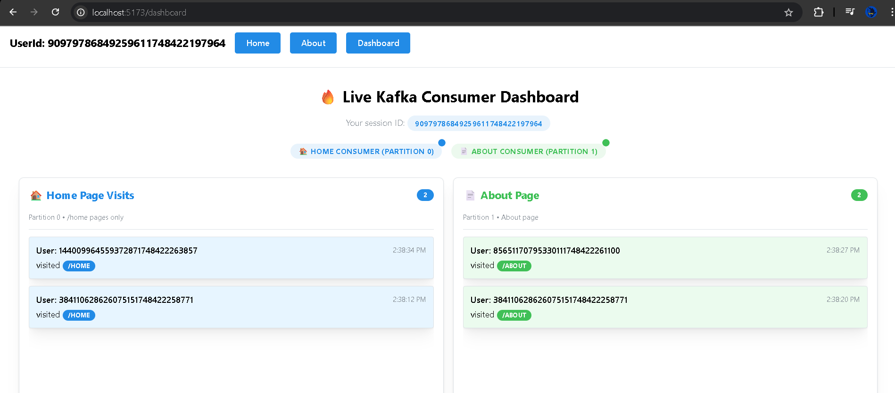
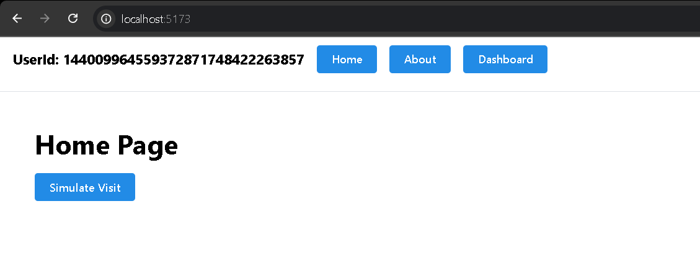
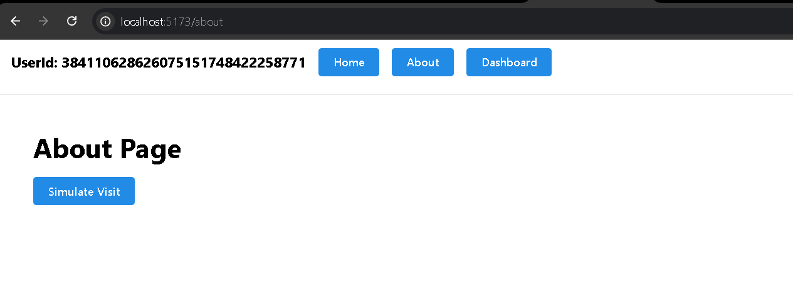

⚡ Kafka-Powered Real-Time Analytics Pipeline
A production-ready demonstration of Apache Kafka for real-time event streaming, featuring visitor tracking with partitioned consumers, WebSocket integration, and a live analytics dashboard.

🎯 Kafka Concepts Demonstrated

Event-Driven Architecture: Page visits as Kafka events
Topic Partitioning: Route-based partitioning (/home → partition 0, /about → partition 1)
Producer-Consumer Pattern: Single producer, multiple specialized consumers
Real-time Processing: Stream processing with immediate dashboard updates
Consumer Groups: Scalable message consumption with pages-group

## 📸 Demo

> 🎥 [Watch Demo Video](./assets/demo-video.mp4)

---

## 🏗️ Architecture

---

## 💻 Tech Stack

| Layer     | Tech                          |
| --------- | ----------------------------- |
| Frontend  | React, Mantine UI, Socket.IO  |
| Backend   | Node.js (TypeScript), KafkaJS |
| Messaging | Apache Kafka                  |
| Realtime  | Socket.IO                     |

---

## 🔍 Features

- Live visitor tracking with unique session IDs
- Kafka-based partitioned consumers (`/home` → partition 0, `/about` → partition 1)
- Visual real-time updates via Socket.IO
- Dashboard built with Mantine UI

---

## 📷 Screenshots

### 📊 Kafka Dashboard

### 🏠 Home Page

### 📄 About Page

---
